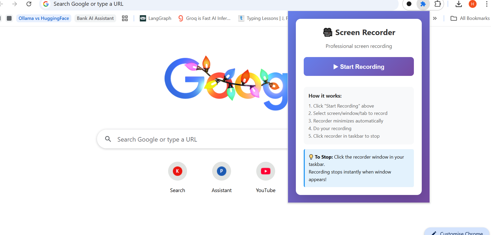
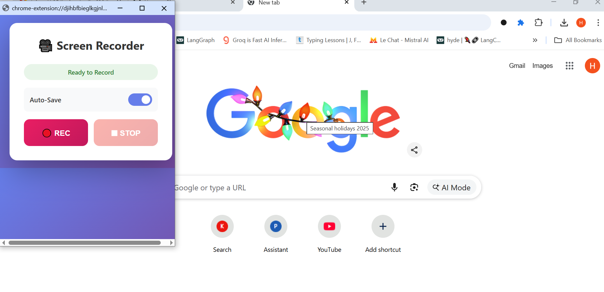
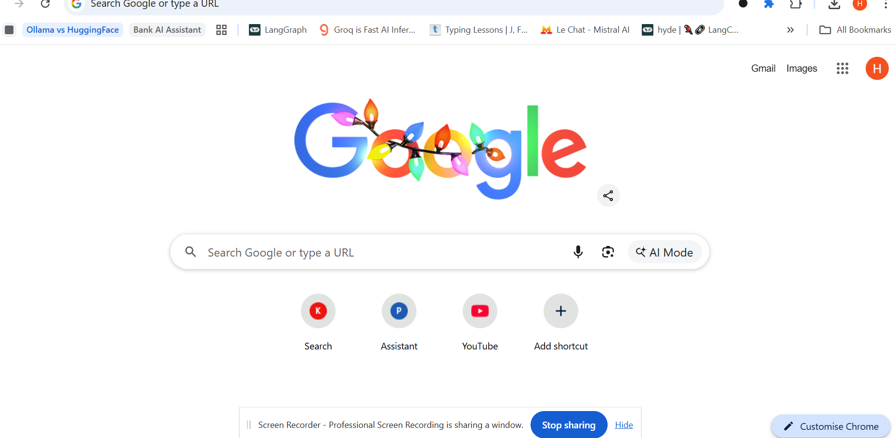
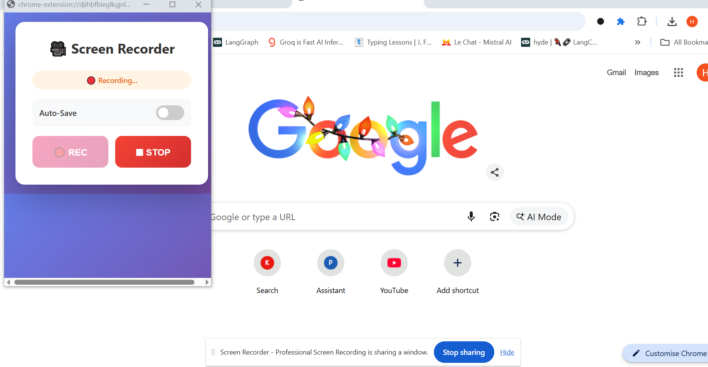

# 🎥 Screen Recorder - Chrome Extension

> **Professional screen recording for Chrome with MP4 support, auto-minimize, and invisible recording. Perfect for tutorials, presentations, and demos.**

[](https://opensource.org/licenses/MIT)
[](https://github.com/wish628/screen-recorder-extension)
[](https://github.com/wish628/screen-recorder-extension/releases)

## ✨ Features

- 🎬 **Screen Recording** - Capture entire screen, specific windows, or browser tabs
- 🎤 **Audio Recording** - Record with microphone audio (MP4/H.264 + AAC)
- 🪟 **Detached Window** - Persistent recorder window that stays open when switching tabs
- ✨ **Auto-Minimize** - Recorder automatically hides during recording
- 🛑 **Smart Stop** - Recording stops instantly when you restore the window
- 💾 **Auto-Download** - Videos save automatically to your Downloads folder
- 🎨 **Modern UI** - Beautiful gradient interface with smooth animations
- 🔒 **Privacy-Focused** - No data collection, all processing happens locally

## 📸 Screenshots

### Extension Popup


*Clean, simple launcher - one click to start recording*

### Recorder Window


*Minimalist interface with auto-save toggle*

### Recording in Progress


*Live recording status with pulsing indicator*

### Auto-Save Toggle Feature


*Control auto-save behavior with a simple toggle*

## 🚀 Quick Start

### Installation

1. Download or clone this repository
2. Open Chrome and navigate to `chrome://extensions/`
3. Enable **Developer mode** (toggle in top-right)
4. Click **Load unpacked**
5. Select the extension folder
6. Done! The extension icon appears in your toolbar

### Usage

1. **Click** the extension icon
2. **Click** "▶ Start Recording"
3. **Select** screen/window/tab to record
4. **Click** "Share" and allow microphone
5. Recorder window **minimizes automatically**
6. **Record** your content
7. **Click** the recorder in taskbar to stop
8. Video **downloads automatically**!

## 🎯 How to Stop Recording

The recorder uses **Smart Stop** technology:

1. While recording, the window is minimized in your taskbar
2. Click the **Screen Recorder** window in taskbar
3. Recording **stops instantly** when window appears
4. The recorder window won't be visible in your video!

## 🛠️ Technical Details

| Feature | Details |
|---------|---------|
| **Manifest Version** | 3 |
| **Video Format** | MP4 (H.264+AAC) with WebM fallback |
| **Max Resolution** | 1920x1080 @ 30fps |
| **Permissions** | `desktopCapture`, `downloads` |
| **Architecture** | Popup + Detached Window + Service Worker |

## 📁 Project Structure

```
screen-recorder-extension/
├── manifest.json          # Extension configuration
├── background.js          # Service worker for downloads
├── popup.html            # Extension popup launcher
├── popup.js              # Popup logic
├── recorder.html         # Detached recorder window
├── recorder.js           # Recording logic
├── icon.svg              # Extension icon
├── LICENSE               # MIT License
├── PRIVACY_POLICY.md     # Privacy policy
├── CHROME_WEB_STORE.md   # Publishing guide
└── README.md             # This file
```

## 🔧 How It Works

1. **Desktop Capture API** - Prompts user to select screen/window/tab
2. **MediaRecorder API** - Records the selected media stream
3. **Web Audio API** - Merges microphone audio with screen capture
4. **Auto-Minimize** - Window minimizes before recording starts
5. **Smart Stop** - Detects window focus and stops recording instantly
6. **Direct Download** - Creates blob URL and triggers download

## 🐛 Troubleshooting

### Extension won't load
- Ensure all files are in the extension folder
- Check for errors in `chrome://extensions/`
- Try reloading the extension

### Recording fails to start
- Make sure you click **Share** (not Cancel)
- Allow microphone access when prompted
- Check browser console for errors

### No audio in recording
- Microphone permission was denied
- Recording continues as video-only
- Re-allow microphone in Chrome settings

### Video won't play
- Try VLC media player for better codec support
- Ensure recording was at least 2-3 seconds long
- Check if file size is greater than 0 bytes

## 🎨 Features in Detail

### Auto-Minimize
The recorder window automatically minimizes 800ms after you click REC. This ensures:
- Window is completely hidden before recording starts
- Clean recordings without the recorder UI visible
- Smooth user experience

### Smart Stop
When you click the recorder window in your taskbar:
- Recording stops **immediately** on window focus
- Stops **before** the window paints on screen
- Ensures the recorder never appears in your video

### MP4 Support
The extension prioritizes MP4 (H.264) encoding:
- Better compatibility with video players
- Smaller file sizes
- Automatic fallback to WebM if MP4 unavailable

## 📝 Version History

### v1.4.0 (Current)
- ✅ Professional UI redesign with gradients
- ✅ Simplified workflow (one-click start)
- ✅ Improved Smart Stop reliability
- ✅ Better error handling and user feedback
- ✅ Chrome Web Store ready

### v1.3
- ✅ MP4/H.264 recording support
- ✅ Auto-minimize feature
- ✅ Direct blob download (no background worker dependency)

### v1.2
- ✅ Detached recorder window
- ✅ Smart Stop feature
- ✅ Keep-alive mechanism

## ⚠️ Limitations

- **System Audio**: Cannot capture system audio (browser limitation)
- **Microphone Only**: Only microphone audio can be recorded
- **Chrome Only**: Designed specifically for Chrome/Chromium browsers
- **Permissions Required**: Needs screen capture and microphone permissions

## 🚀 Chrome Web Store

Ready to publish! See [CHROME_WEB_STORE.md](CHROME_WEB_STORE.md) for detailed publishing instructions.

## 🔒 Privacy

This extension does NOT collect any data. See [PRIVACY_POLICY.md](PRIVACY_POLICY.md) for details.

## 🤝 Contributing

Contributions are welcome! Feel free to:
- Report bugs
- Suggest new features
- Submit pull requests
- Improve documentation

## 📄 License

This project is licensed under the MIT License - see the [LICENSE](LICENSE) file for details.

## 💡 Tips

- Use the **Recorder Window** mode for best results
- Keep recordings under 30 minutes for optimal performance
- Close unnecessary tabs before recording to save memory
- Test your setup with a short recording first

## 🔗 Links

- [GitHub Repository](https://github.com/wish628/screen-recorder-extension)
- [Report Issues](https://github.com/wish628/screen-recorder-extension/issues)
- [Privacy Policy](PRIVACY_POLICY.md)
- [Chrome Web Store](#) *(Coming soon)*

---

**Made with ❤️ by [wish628](https://github.com/wish628)**

*Last Updated: December 2024*
